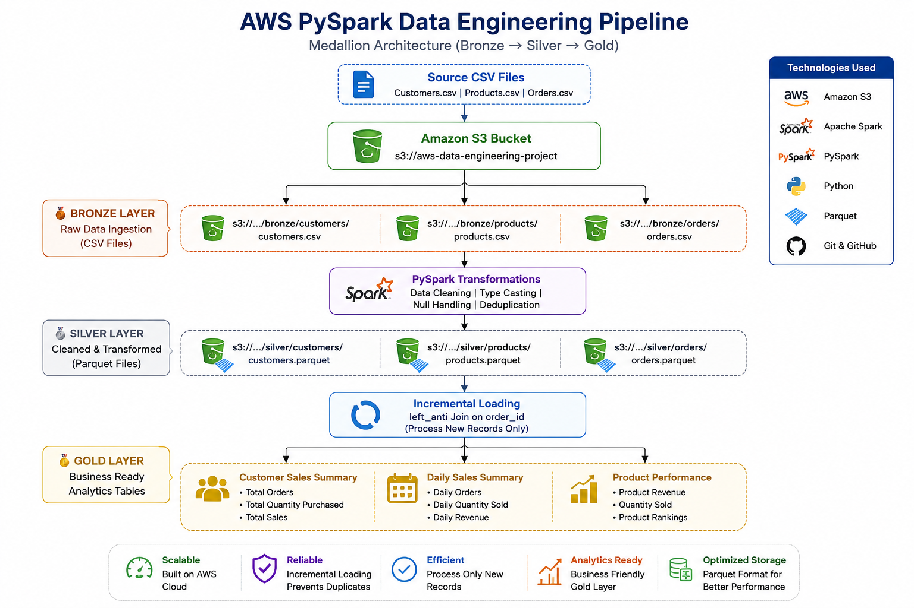
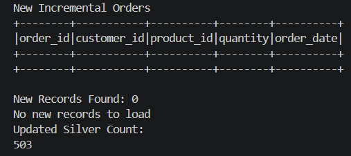

# 🚀 AWS PySpark Data Engineering Pipeline


An end-to-end **AWS Data Engineering pipeline** built using **Amazon S3, Apache Spark, and PySpark** following the **Medallion Architecture (Bronze → Silver → Gold)**.

This project demonstrates how to build a scalable cloud-based data lake by ingesting raw e-commerce data into Amazon S3, transforming it with PySpark, implementing incremental loading, and creating analytics-ready datasets.

---

# 📌 Project Overview

This project simulates a real-world e-commerce data platform where customer, product, and order datasets are processed through a complete ETL pipeline.

The pipeline:

- Stores raw data in Amazon S3 (Bronze layer)
- Cleans and transforms data using PySpark
- Stores processed data as Parquet files (Silver layer)
- Performs incremental loading to process only new records
- Creates business-ready Gold layer analytics tables

This project demonstrates practical Data Engineering concepts including:

- Data Lake Architecture
- ETL Pipeline Development
- PySpark Transformations
- Incremental Data Processing
- Data Modeling
- Analytics Data Preparation

---

# 🏗️ Architecture



---

# 🔄 Pipeline Flow

```
                 Source CSV Files
                        │
                        ▼
                  Amazon S3 Bucket
                        │
        ┌───────────────┴───────────────┐
        ▼                               ▼
   Bronze Layer                  Raw CSV Files
        │
        ▼
PySpark Transformations
        │
        ▼
   Silver Layer
(Clean Parquet Files)
        │
        ▼
Incremental Loading
(left_anti Join)
        │
        ▼
    Gold Layer
        │
 ┌──────┼─────────┐
 ▼      ▼         ▼
Customer Daily   Product
Summary  Sales   Performance
```

---

# ⚙️ Technology Stack

| Technology | Purpose |
|------------|---------|
| Amazon S3 | Cloud Data Lake Storage |
| Apache Spark | Distributed Data Processing |
| PySpark | ETL Development |
| Python | Data Processing |
| Parquet | Optimized Storage Format |
| SQL | Analytics & Validation |
| Git & GitHub | Version Control |

---

# 📂 Repository Structure

```
aws-data-engineering-project
│
├── architecture/
│
├── data/
│
├── docs/
│
├── notebooks/
│
├── scripts/
│   ├── bronze_ingestion.py
│   ├── silver_transformation.py
│   ├── incremental_load.py
│   └── gold_transformation.py
│
├── README.md
├── requirements.txt
└── .gitignore
```

---

# 🥉 Bronze Layer

The Bronze layer stores raw source data exactly as received.

### Datasets

- Customers
- Products
- Orders

### Implemented

- Raw CSV ingestion
- Amazon S3 storage
- Source data organization

Example:

```
bronze/
├── customers/
├── products/
└── orders/
```

---

# 🥈 Silver Layer

The Silver layer contains cleaned and transformed datasets.

### Transformations

- Schema validation
- Data cleaning
- Null handling
- Data type conversion
- Duplicate removal
- Standardization

### Storage Format

- Parquet

Example:

```
silver/
├── customers/
├── products/
└── orders/
```

---

# 🔄 Incremental Loading

Instead of processing the entire dataset every time, the pipeline processes **only newly arrived records**.

Implementation:

- Read existing Silver data
- Read new Bronze data
- Compare records using `order_id`
- Identify new records using Spark **left_anti join**
- Append only new records to the Silver layer

Benefits:

- Faster processing
- Prevents duplicate records
- Production-style ETL workflow

---

# 🥇 Gold Layer

The Gold layer contains business-ready datasets for reporting and analytics.

## Customer Sales Summary

Provides:

- Total Orders
- Total Quantity Purchased
- Total Sales

---

## Daily Sales Summary

Provides:

- Daily Orders
- Daily Quantity Sold
- Daily Revenue

---

## Product Performance

Provides:

- Product Revenue
- Quantity Sold
- Product Rankings

---

# ✅ Features

- Medallion Architecture (Bronze → Silver → Gold)
- AWS S3 Data Lake
- PySpark ETL Pipeline
- Incremental Data Loading
- Duplicate Prevention
- Parquet Storage
- Business Analytics Tables
- Production-inspired Project Structure
- Git Version Control

---

# 📊 Sample Dataset

Synthetic e-commerce datasets containing:

- 100 Customers
- 10 Products
- 500+ Orders

Additional order records are used to demonstrate incremental loading.

---

# ▶️ How to Run

### Clone the repository

```bash
git clone https://github.com/anshu02042002/aws-data-engineering-project.git
```

# 📸 Project Screenshots

## AWS S3 Data Lake

The project stores raw, cleaned, and analytics-ready datasets in Amazon S3 following the Medallion Architecture.


---

## Incremental Loading

The pipeline processes only new records using a **left_anti join**, preventing duplicate data from being loaded into the Silver layer.



### Install dependencies

```bash
pip install -r requirements.txt
```

### Configure AWS credentials

Ensure your AWS credentials are configured locally.

### Run the scripts

```
bronze_ingestion.py
        ↓
silver_transformation.py
        ↓
incremental_load.py
        ↓
gold_transformation.py
```

---

# 👨‍💻 Author

## Anshu Gupta

Aspiring Data Engineer passionate about building scalable cloud data pipelines using AWS and Apache Spark.

### Connect with Me

- **GitHub:** https://github.com/anshu02042002
- **LinkedIn:** https://www.linkedin.com/in/anshu-gupta-de

---

# 🛠️ Skills Demonstrated

- Python
- SQL
- Apache Spark
- PySpark
- AWS S3
- ETL Pipeline Development
- Incremental Data Loading
- Data Lake Architecture
- Parquet
- Git & GitHub
